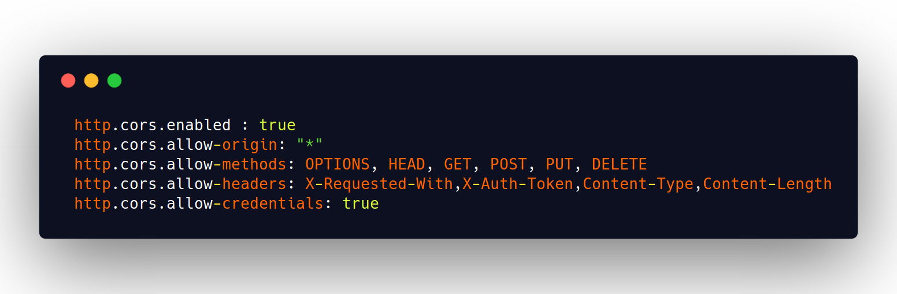

<h1 align="center">SWAPI</h1>

Ultimate Star Wars Search using ElasticSearch and Vue JS

### Requirements

<ul>
  <li>Elastic Search</li>
  <li>Python 3</li>
  <li>Vue JS</li>
</ul>

### ES Config
Allow http access through Vue code by adding the following configs to /config/elasticsearch.yml file in ES directory.

Now run elasticsearch. It should be up on port 9200.

### Python Config
Installing requirements for python

After a few seconds, you should see `done indexing`. Go to [People Search](http://localhost:9200/swapi/people/_search) . All the json files inside [src directory](https://github.com/VinayakBagaria/SWAPI/tree/master/src) get indexed into ES.

### Vue Config

Now install packages defined in package.json by running

      npm install

Now run

      npm run dev
Voila...!! Type in a name in the search box and your result is the filtered names.

### Credits

Hosted [API](https://www.swapi.co) 
Django REST [Source Code](https://github.com/phalt/swapi) for the API
